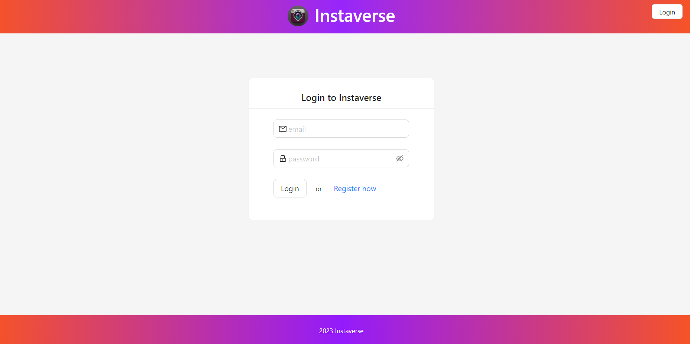
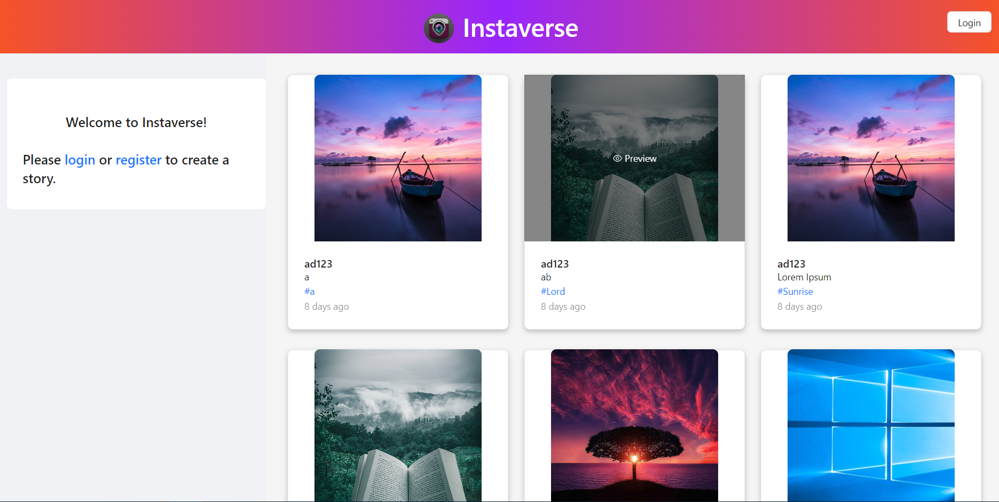
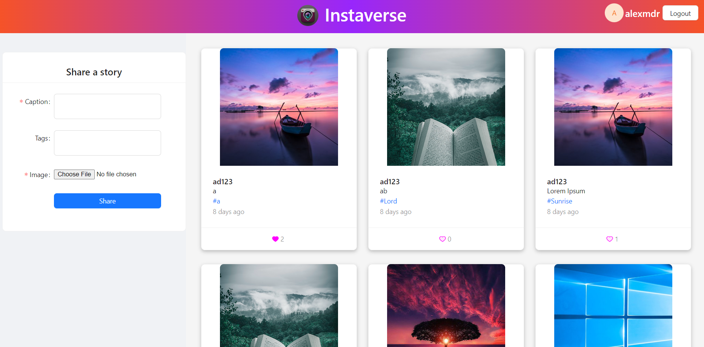
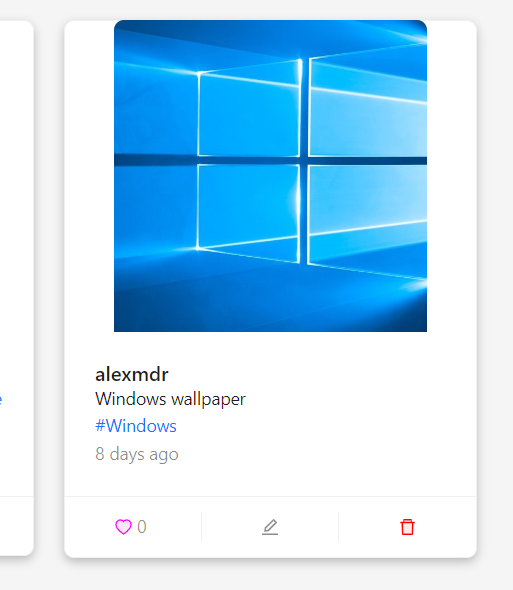

## MERN Social Media App

A social media app made with ReactJs, Express, MongoDB and Node.

There are 2 types of users:

- Guests can register/login and view all posts.
- Logged users can create posts, update and delete their posts and like/unlike posts.

Other technologies/libraries used:

- Axios for communication between frontend and backend
- Antd Design for application design
- Redux for frontend data storage
- JWT for authentication
- Moment for date/time display
- React Router for page navigation

### App overview

##### Login/Register page

On the login page the users can register or login into the app by completing a form.

##### Guest view

Guests can only view the posts.

##### Logged user view

A user can logout by clicking on the top right button of the page.

Logged users can make new posts or update information of existing ones by using the form in the right side of the page.

They can also see which posts they have already liked (and unlike them if they choose to), like other posts and see their number or likes

##### Logged user post view

The logged user can initialise the editing form by clicking on an owned post middle icon or delete their post by clicking on the right icon.

### What I learned?

This project is a better application than the final project resulted as a summary of the knowlegde I learned through the MERN Fullstack Web Application with React & Web Development Course on Udemy.

In this project I learned how to work with MongoDB and mongoose and also tried using the design library Ant Design. I also used the useForm hook from antd for the form data.

More practice with React, Redux and Express.

### How to run ?

Backend(client)

> npm run

Frontend(client)

> npx serve -s build
